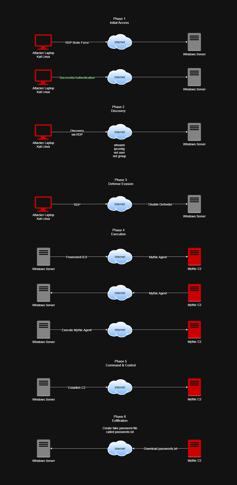

# Attack Scenarios

This document maps every attack simulated in the lab to the MITRE ATT&CK framework. It is built up progressively as each attack phase is completed — from brute force detection through to the full Mythic C2 chain.

Each scenario includes the attack description, the tools used, the detection method, and a link to the corresponding investigation write-up where applicable.

---

## Overview

| # | Scenario | Target | Steps | Status |
|---|---|---|---|---|
| 1 | SSH Brute Force | Ubuntu Server VM3 (`ubuntutarget`) | 10, 14 | ✅ Detected |
| 2 | RDP Brute Force | Windows Server VM2 (`WIN-KT9TVSF1T0C`) | 11, 15 | ✅ Detected |
| 3 | Mythic C2 Full Attack Chain | Windows Server VM2 (`WIN-KT9TVSF1T0C`) | 20–23 | ✅ Detected |

---

## Scenario 1 — SSH Brute Force

### Description
Repeated automated SSH login attempts against the Ubuntu Server target using incorrect credentials. The goal is to gain initial access to the Linux endpoint via password guessing.

### Attack details
| Property | Value |
|---|---|
| Target | Ubuntu Server VM3 |
| Agent name | `ubuntutarget` |
| Protocol | SSH (port 22) |
| Tool | Manual attempts |
| Credential type | Username + password guessing |
| Steps performed | Traffic generation + detection rule |

### MITRE ATT&CK mapping
| Tactic | Technique | ID | Notes |
|---|---|---|---|
| Credential Access | Brute Force: Password Guessing | T1110.001 | Repeated failed SSH attempts from single user |
| Initial Access | Valid Accounts | T1078 | Successful SSH login after correct credentials found |

### Detection rule
| Property | Value |
|---|---|
| Rule name | SSH Brute Force Activity - ubuntutarget |
| Rule type | Threshold |
| Query | `agent.name: "ubuntutarget" AND system.auth.ssh.event: "Failed"` |
| Group by | `user.name` |
| Threshold | Count > 5 within 2 minutes |
| Severity | Low |
| Rule file | `detection-rules/ssh-brute-force-rule.json` |

### Key log fields
```kql
# Detection query
agent.name: "ubuntutarget" AND system.auth.ssh.event: "Failed"

# Key fields in the alert
system.auth.ssh.event   → "Failed" / "Accepted"
source.ip               → attacker IP
user.name               → username attempted
source.geo.country_name → origin country (external IPs only)

# Successful SSH login (post-brute force)
agent.name: "ubuntutarget" AND system.auth.ssh.event: "Accepted"
```

### Investigation write-up
`investigations/ssh-brute-force-investigation.md` *(to be completed)*

---

## Scenario 2 — RDP Brute Force

### Description
Repeated automated RDP login attempts against the Windows Server target using incorrect credentials. Windows event code `4625` with LogonType `10` or `3` is the key telemetry signal.

### Attack details
| Property | Value |
|---|---|
| Target | Windows Server VM2 |
| Agent name | `WIN-KT9TVSF1T0C` |
| Protocol | RDP (port 3389) |
| Tool | Manual RDP attempts |
| Credential type | Username + password guessing |
| Steps performed | Traffic generation + detection rule |

### MITRE ATT&CK mapping
| Tactic | Technique | ID | Notes |
|---|---|---|---|
| Credential Access | Brute Force: Password Guessing | T1110.001 | Repeated event.code 4625 with LogonType 10 or 3 |
| Initial Access | Valid Accounts: Local Accounts | T1078.003 | Successful RDP login used for C2 attack chain |

### Detection rule
| Property | Value |
|---|---|
| Rule name | RDP Brute Force Activity - WIN-KT9TVSF1T0C |
| Rule type | Threshold |
| Query | `agent.name: "WIN-KT9TVSF1T0C" AND event.code: "4625" AND (winlog.event_data.LogonType: "10" OR winlog.event_data.LogonType: "3")` |
| Group by | `source.ip` |
| Threshold | Count > 5 within 2 minutes |
| Severity | Low |
| Rule file | `detection-rules/rdp-brute-force-rule.json` |

### Key log fields
```kql
# Detection query
agent.name: "WIN-KT9TVSF1T0C" AND
event.code: "4625" AND
(winlog.event_data.LogonType: "10" OR winlog.event_data.LogonType: "3")

# Key fields in the alert
event.code                        → 4625 (failed logon)
winlog.event_data.LogonType       → 10 (RDP) or 3 (network — local lab)
winlog.event_data.TargetUserName  → username attempted
source.ip                         → attacker IP
winlog.event_data.WorkstationName → attacker machine name

# Successful RDP login (post-brute force)
agent.name: "WIN-KT9TVSF1T0C" AND
event.code: "4624" AND
(winlog.event_data.LogonType: "10" OR winlog.event_data.LogonType: "3")
```

### Investigation write-up
`investigations/rdp-brute-force-investigation.md` *(to be completed)*

---

## Scenario 3 — Mythic C2 Full Attack Chain

### Description
A full end-to-end attack simulation using the Mythic C2 framework with an Apollo agent. The attack begins with RDP brute force for initial access, followed by host discovery, defense evasion (disabling Windows Defender), and establishing a C2 beacon back to the Mythic server on VM4.

This is the most complex scenario in the lab and maps to multiple MITRE ATT&CK tactics across the full kill chain.

### Attack details
| Property | Value |
|---|---|
| Target | Windows Server VM2 |
| Attacker | Mythic C2 VM4 |
| C2 Framework | Mythic |
| Agent | Apollo (Windows x64) |
| Payload filename | `apollo.exe` |
| C2 profile | HTTP |
| Callback host | `http://172.31.0.134` |
| Callback port | `80` |
| Callback interval | `10` seconds |

### Attack chain diagram



### MITRE ATT&CK mapping

| # | Stage | Action | Tactic | Technique | ID |
|---|---|---|---|---|---|
| 1 | Initial Access | RDP brute force password guessing | Credential Access | Brute Force: Password Guessing | T1110.001 |
| 2 | Initial Access | Successful RDP login with compromised credentials | Initial Access | Valid Accounts: Local Accounts | T1078.003 |
| 3 | Defense Evasion | Disable Windows Defender real-time protection | Defense Evasion | Impair Defenses: Disable or Modify Tools | T1562.001 |
| 4 | Execution | Apollo agent executed on target | Execution | User Execution: Malicious File | T1204.002 |
| 5 | Command & Control | Apollo HTTP beacon to Mythic C2 | Command & Control | Application Layer Protocol: Web Protocols | T1071.001 |
| 6 | Discovery | `whoami` — identify current user context | Discovery | System Owner/User Discovery | T1033 |
| 7 | Discovery | `ipconfig` — enumerate network configuration | Discovery | System Network Configuration Discovery | T1016 |
| 8 | Discovery | `net user` — enumerate local accounts | Discovery | Account Discovery: Local Account | T1087.001 |
| 9 | Discovery | `net group` — enumerate domain groups | Discovery | Account Discovery: Domain Account | T1087.002 |

### Detection rules

| Stage | Rule name | Severity | Rule file | Status |
|---|---|---|---|---|
| Initial Access | RDP Brute Force Activity - WIN-KT9TVSF1T0C | Low | `detection-rules/rdp-brute-force-rule.json` | ✅ |
| C2 Agent Execution | Mythic C2 - Apollo Agent Detected - WIN-KT9TVSF1T0C | Critical | `detection-rules/mythic-c2-apollo-process-creation.json` | ✅ |
| C2 Network Beacon | Mythic C2 Activity Dashboard — Panel 2 | — | `dashboards/mythic-c2-activity-dashboard.ndjson` | ✅ |
| Defense Evasion | Mythic C2 Activity Dashboard — Panel 3 (Event ID 5001) | — | `dashboards/mythic-c2-activity-dashboard.ndjson` | ✅ |

### Key log queries (Sysmon telemetry)

```kql
# Process Creation (PowerShell, CMD, Rundll32)
event.code: 1 AND event.provider: Microsoft-Windows-Sysmon AND (powershell or cmd or rundll32)

# Process Initiated Network Connections
event.code: 3 AND event.provider: Microsoft-Windows-Sysmon AND winlog.event_data.Initiated: true 

# Microsoft Defender Disabled
event.code: 5001 AND event.provider: Microsoft-Windows-Windows Defender

#Apollo agent detection
event.code: 1 AND (winlog.event_data.Hashes: *6FC88C6EE1298FA03ADE7125E2E040C3946C8535ACCB455EB16225C5EE55A3DD* OR winlog.event_data.OriginalFileName: Apollo.exe)
```

Added to `resources/kql-cheatsheet.md`

### Dashboard
| Dashboard name | File | Panels |
|---|---|---|
| Mythic C2 Activity Dashboard | `dashboards/mythic-c2-activity-dashboard.ndjson` | Process creation (ID 1), Outbound connections (ID 3), Defender disabled (ID 5001) |

### Investigation write-up
`investigations/mythic-c2-investigation.md` *(to be completed)*

---

## Detection coverage summary

| MITRE Technique | ID | Detection rule / dashboard | Status |
|---|---|---|---|
| Brute Force: Password Guessing — SSH | T1110.001 | `detection-rules/ssh-brute-force-rule.json` | ✅ |
| Brute Force: Password Guessing — RDP | T1110.001 | `detection-rules/rdp-brute-force-rule.json` | ✅ |
| Valid Accounts: Local Accounts | T1078.003 | RDP brute force rule (event.code 4624) | ✅ |
| User Execution: Malicious File | T1204.002 | `detection-rules/mythic-c2-apollo-process-creation.json` | ✅ |
| Application Layer Protocol: Web | T1071.001 | Mythic C2 dashboard — Panel 2 (Event ID 3) | ✅ |
| Impair Defenses: Disable Tools | T1562.001 | Mythic C2 dashboard — Panel 3 (Event ID 5001) | ✅ |

---

## Ticketing integration

All active detection rules are connected to osTicket via Kibana Webhook connector. When any rule fires, a ticket is automatically created in the osTicket staff panel.

| Rule | Connector |
|---|---|
| SSH Brute Force Activity - ubuntutarget | osTicket - SOC Lab | 
| RDP Brute Force Activity - WIN-KT9TVSF1T0C | osTicket - SOC Lab |
| Mythic C2 - Apollo Agent Detected - WIN-KT9TVSF1T0C | osTicket - SOC Lab | 

---

## References

- [MITRE ATT&CK Framework](https://attack.mitre.org/)
- [Mythic C2 Documentation](https://docs.mythic-c2.website/)
- [Apollo Agent GitHub](https://github.com/MythicAgents/Apollo)
- [Sysmon Event ID Reference](https://learn.microsoft.com/en-us/sysinternals/downloads/sysmon)
- [Windows Security Event Log Reference](https://learn.microsoft.com/en-us/windows/security/threat-protection/auditing/basic-audit-logon-events)
- [osTicket Tickets API](https://github.com/osTicket/osTicket/blob/develop/setup/doc/api/tickets.md)