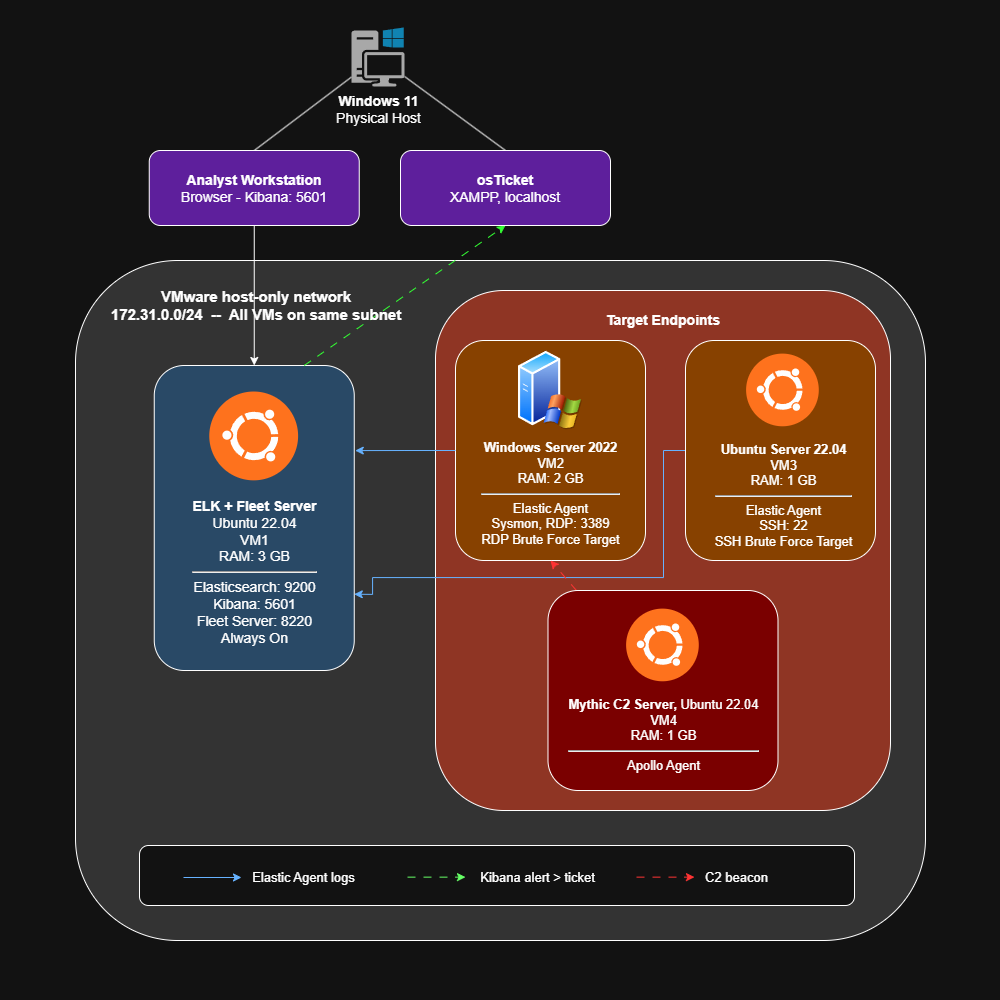

# 🛡️ SOC Home Lab

## Overview
Hands-on SOC lab built step by step using Elasticsearch, Logstash, Kibana, Sysmon, Mythic C2, osTicket

## Architecture

## Local lab setup (8GB RAM)
| VM | OS | RAM | Purpose |
|----|-----|-----|---------|
| ELK + Fleet (VM1) | Ubuntu 22.04 | 3GB | SIEM + agent mgmt |
| Windows target (VM2) | Windows Server 2022 | 2GB | RDP target + Sysmon |
| Ubuntu target (VM3) | Ubuntu 22.04 | 1GB | SSH target |
| Mythic C2 (VM4) | Ubuntu 22.04 | 1GB | Attack sim |
| osTicket | Windows 11 host (XAMPP) | — | Ticketing |

## Tools
Elasticsearch · Kibana · Fleet Server · Elastic Agent · Sysmon · Mythic C2 · osTicket · VirtualBox

## Progress
| Step | Topic | Status |
|------|-------|--------|
| 1 | Logical diagram | ✅ |
| 2 | Install Elasticsearch (VM1) | ✅ |
| 3 | Install Kibana (VM1) | 🔄 |

## Skills demonstrated
- SIEM deployment and configuration
- Detection rule engineering (KQL / EQL)
- Brute force attack detection (SSH + RDP)
- C2 framework detection (Mythic / Apollo agent)
- MITRE ATT&CK mapping
- Incident investigation workflow
- Ticketing system integration
- EDR configuration (Elastic Defend)